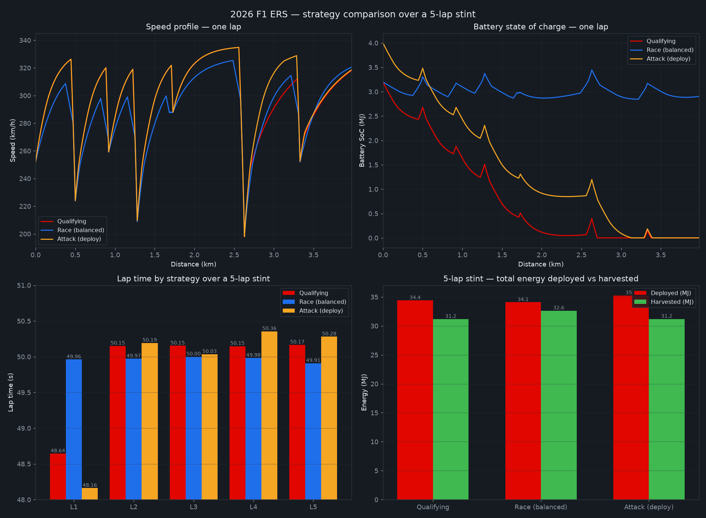

# 2026 F1 ERS - Electric Power Unit Demonstration

A professional Python implementation of the 2026 Formula 1 Energy Recovery System (ERS) modeling the power electronics and control logic behind a hybrid electric power unit.


## 🚀 Features

- **Embedded-Style Control Logic** - Frames derating / Superclip / Override as discrete control rules an ECU would implement
- **Physics-Driven Lap Simulation** - 1D track model with corner braking, throttle, and drag at 0.01s resolution
- **Full ERS Energy Bookkeeping** - Battery deploy / harvest against the 4 MJ energy window
- **Multiple Control Strategies** - Qualifying, Race (balanced), Attack, Bank-and-Attack, Overtake
- **State-Dependant Top Speed** - Effective vmax interpolates between empty (341 km/h) and full-charge (355 km/h) battery
- **Manual Override Modeling** - +0.5 MJ overtake burst with derating disabled up to true top speed

## 📊 System Performance

| Metric | Value | Industry Standard |
|--------|-------|-------------------|
| Power Unit Output | 400kW ICE + 350kW MGU-K (~47% electric) | ~40% electric |
| Battery Energy Window | 4 MJ | 4 MJ (2026 regs) |
| Harvest Cap | 8.5 MJ per lap | 8.5 MJ (2026 regs) |
| Lap Time Spread (Qualifying vs Race) | 48.6s – 50.4s | Strategy-dependent |

## 🔧 Model Overview



## 🛠️ Technical Implementation

### Core Algorithms
- **1D Lap Simulator** - Corner-aware braking, throttle, and drag model marching the car around the track at fixed timestep
- **Deploy Derating** - MGU power scales linearly to zero between 290–355 km/h, so batteries can't push past regulation top speed
- **Superclip Harvesting** - Extended energy recovery above 250 km/h to recover charge after a deploy dump
- **Seeded Lap Variation** - Reproducible tyre-wear drift and traffic jitter so stints are never a flat line

### Monitoring Capabilities
- Real-time speed, battery SoC, and lap time tracking across a 5-lap stint
- Deployed-vs-harvested energy accounting per strategy
- Bank-and-attack sequencing (conserve laps followed by an attack lap)
- Side-by-side strategy comparison across all scenarios

## 📁 Project Structure

```text
F1-ERS-Simulation/
├── 📁 Assets/
│   └── strategy_comparison.png
├── 📄 config.py
├── 📄 track.py
├── 📄 powerunit.py
├── 📄 battery.py
├── 📄 sim.py
├── 📄 strategy.py
├── 📄 theme.py
├── 📄 main.py
├── 📄 requirements.txt
├── 📄 LICENSE
└── 📄 README.md
```

## 🚦 Getting Started

### Prerequisites
- Python 3.9 or newer
- pip

### Installation
**1. Clone the repository**
   \`\`\`bash
   git clone https://github.com/yasser-moussi/F1-ERS-Simulation.git
   cd F1-ERS-Simulation
   \`\`\`
**2. Create a virtual environment and install dependencies**
   \`\`\`bash
   python -m venv .venv
   source .venv/bin/activate          # Windows: .venv\Scripts\activate
   pip install -r requirements.txt
   \`\`\`

**3. Run the Simulation**
   \`\`\`bash
   python main.py
   \`\`\`

**4. View the results**

- Check the console for per-lap stint tables and the 5-lap comparison summary
- Open `strategy_comparison.png` for speed, SoC, lap time, and energy plots
- Compare strategies side by side: Qualifying, Race (balanced), Attack, Bank-and-attack

## 🎯 Key Results

- **Qualifying Pace**: Fastest opening lap at 48.64s using maximum deploy with superclip recovery
- **Race Balance**: Consistent ~49.9–50.0s laps while holding battery SoC roughly flat
- **Attack Deploy**: Fast first lap (48.16s) from a pre-banked full battery, tailing off as charge depletes
- **Energy Accounting**: ~31–35 MJ deployed vs ~31–33 MJ harvested per 5-lap stint across all strategies

## 📞 Contact

**Yasser Moussi**
- Email: yasser.moussi.kfz@gmail.com
- LinkedIn: [Yasser Moussi](https://www.linkedin.com/in/yasser-moussi/)
